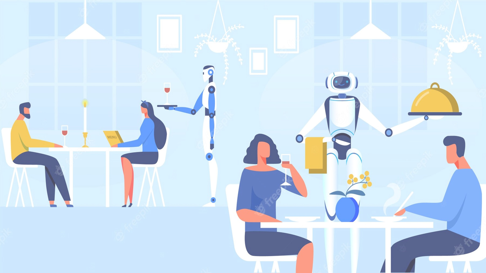
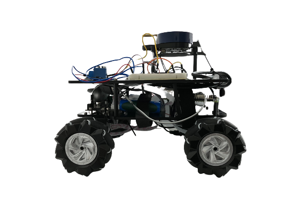
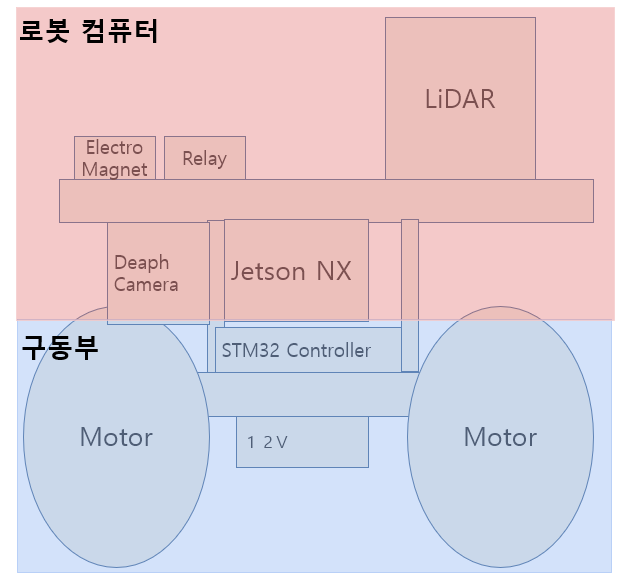
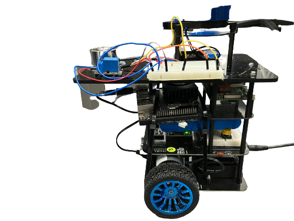
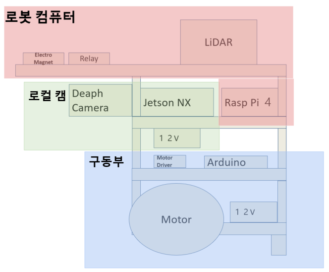
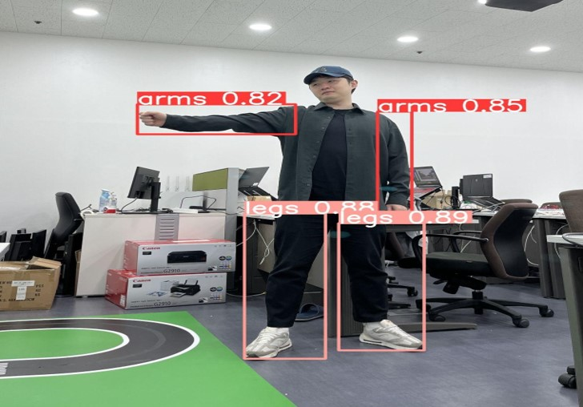
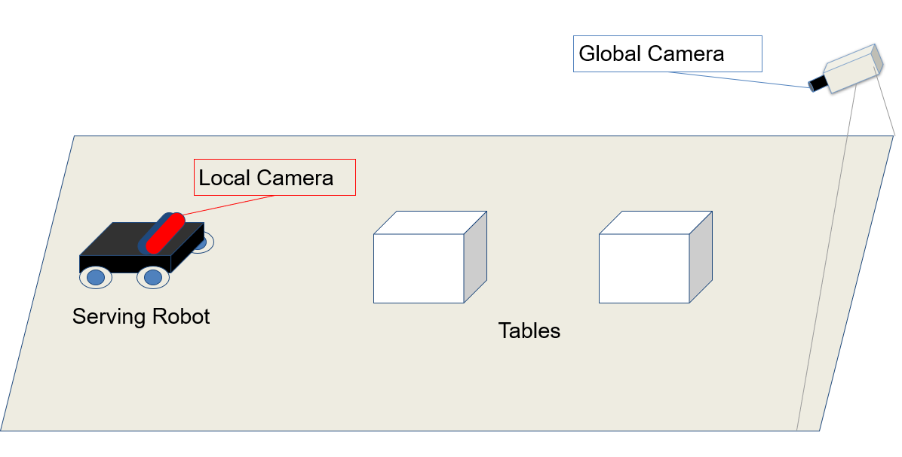

## 프로젝트 기획 및 컨셉
  
사람이 도와주지 않으면 서빙이 안돼는 현세대 서빙로봇을 보완한 차세대 서빙 로봇  

## 데모영상
  
Planning part : 임용재  
System part : 노태형  
DL part: 신재성  
Computer Vision part : 허동욱  
Firmware part : 성용호  
SLAM & Navigation : 김정현  

## 시스템
### 프로토타입

<b align="left">

<b align="right">

<b align="left">  

#### 로봇 컴퓨터
Model : Jetson NX Develop Kit  
RAM : 8 GB  
OS : Linux 20.04 LTS  
※JetPack = 5.1.1

#### 구동부
MCU : STM32 Controller Board  
Motor : 12V DC Motor X 4  
Wheel : Mecanum Wheel

### 실물 기체
<b align="left">

<b align="right">

<b align="left">  

#### 로봇 컴퓨터
Model : Raspberry pi 4  
CPU : 6-core NVIDIA Carmel ARM v8.2 64-bit CPU 6MB L2 + 4MB L3 
GPU : NVIDIA Volta with 384 CUDA and 48 Tensor Cores  
RAM : 4 GB  
OS : Linux 22.04 LTS  
※JetPack = 5.1.1

#### 로컬 캠
Model : Jetson NX Develop Kit  
RAM : 8 GB  
OS : Linux 20.04 LTS  
※JetPack = 5.1.1

#### 구동부
MCU : Arduino Mega Controller Board  
Motor : 12V DC Motor X 2  
Wheel : differential steering

<위 2개 너무 긴거 같아서 따로 시스템 dev로 뺄까 고민 중>

### 사용된 기술

#### **YOLO**
돌발상황시 사람의 전체가 아닌 팔과 다리가 우선적으로 보이므로  
팔과 다리만을 인식하는 모델 학습 및 라벨링 적용  

<b align="left">  

 Model | Trained |
|-------|---------|
| recognize Arm and Leg | [download (245MB)](https://drive.google.com/file/d/1DHGC-n0PIB-iuSVyvKAjuUM-vJ_csmHB/view?usp=sharing) |

#### **컴퓨터 비전**
  

## [글로벌 카메라처리]()   

## [로컬 카메라처리]()  

### 하드웨어

### Navigation & SLAM
